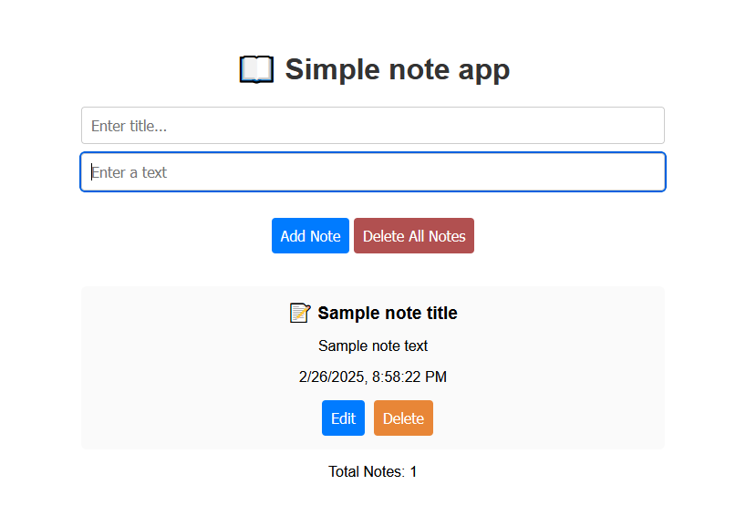

# Fastnoty - A Simple Note-Taking App

Fastnoty is a lightweight and efficient note-taking app built with **React** for the frontend, **Node.js** with **Express** for the backend API, and **TypeScript**. It allows users to create, edit, delete, and organize notes effortlessly.


---

## Features

- **Create Notes**: Add new notes with a title and content.
- **Edit Notes**: Update existing notes with new content.
- **Delete Notes**: Remove notes you no longer need.
- **Responsive Design**: Works seamlessly on desktop and mobile devices.
- **Type Safety**: Built with TypeScript for robust and maintainable code.
- **Real-Time Updates**: Notes are saved and synced in real-time.

---

## Technologies Used

### Frontend
- **React**: A JavaScript library for building user interfaces.
- **TypeScript**: Adds static typing to JavaScript for better code quality.
- **CSS**: For styling the app.
- **React Hooks**: `useState`, `useEffect`, etc., for state management and side effects.

### Backend
- **Node.js**: A JavaScript runtime for building the backend.
- **Express**: A web framework for Node.js to handle API requests.
- **TypeScript**: Used in the frontend and backend for type safety.
- **REST API**: A simple API for CRUD operations on notes.

### Development Tools
- **Vite**: A fast build tool for modern web development.
---

## Getting Started

Follow these steps to set up and run the project locally.

### Prerequisites

- **Node.js**: Make sure you have Node.js installed (v16 or higher).

### Installation

1. **Clone the repository**:
   ```bash
   git clone https://github.com/your-username/fastnoty.git
   cd fastnoty
   
2. **Install dependencies**

***Frontend***
```shell
cd simple-note-app
npm install
```

***Backend***
```shell
cd backend
npm install
```

3. **Running the App**
 
Start the backend server:
```shell
cd backend
npm run build    
node dist/server.js
```

The backend will run on http://localhost:5000.

Start frontend server:
```shell
cd simple-note-app
npm run dev
```
The frontend will run on http://localhost:5174.


